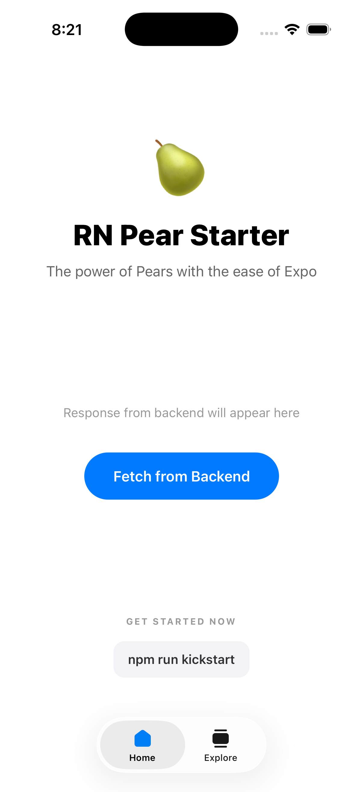
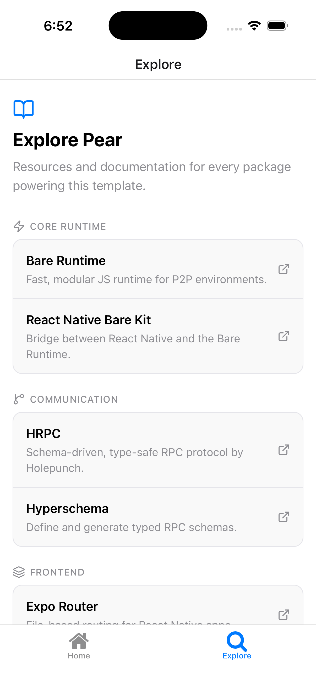

# 🍐 RN Pear Expo Starter

A high-performance, minimal starter template for building decentralized mobile applications using [Expo](https://expo.dev/) and [Pear Technology](https://pears.com/).

This template leverages **Bare Kit** to run a dedicated **Bare Runtime**  backend alongside your React Native frontend. Bare is a lightweight, modular JavaScript runtime (Similar to Node.JS) designed with cross-device compatibility and peer-to-peer environments, enabling seamless P2P communication and decentralized data structures.

---

## 🏗 Architecture

The application is split into two main layers: the **Frontend (React Native)** and the **Backend (Bare Runtime)**, communicating over a high-speed IPC bridge.

---

## 🚀 Key Features

- **P2P**: Integrated peer-to-peer networking powered by the **Bare Runtime**.
- **HRPC Gateway**: Type-safe, ultra-fast inter-process communication between Frontend and Backend.
- **Expo Router**: Modern, file-based routing for React Native.
- **Best Practices**: Pre-configured ESLint, Prettier, and strict import ordering (No semicolons!).

---

## 📱 Screenshots

| Home | Explore |
|------|---------|
|  |  |

---

## 🛠 Project Structure

```text
├── app/               # Expo Router pages (Frontend)
├── backend/           # Bare Runtime backend logic
│   ├── backend.js     # Entry point for backend
│   └── api.js         # API definitions for frontend
├── components/        # Shared UI components
├── spec/              # Protobuf / HRPC schema definitions
├── utils/              # Shared logic (Worklet & RPC orchestration)
└── package.json       # Project dependencies and scripts
```

---

## 🚀 Project Kickstart

To transform this template into your own project, run the interactive kickstart script:

```bash
npm run kickstart
```

This script will:

1. Prompt for your **App Name**, **Slug**, and **Package ID**.
2. Clean and rename all native identifiers across Android (`applicationId`, `namespace`) and iOS (`bundleIdentifier`, `CFBundleName`).
3. Recursively rename physical native directories to match your new Package ID.
4. Strategic cleanup of build artifacts (`android/app/build`, `ios/Pods`, etc.) to ensure a fresh start.
5. Offer to **Clean Template UI** (replaces the demo landing page with a minimal one).
6. Refresh `package-lock.json` and automatically run `npm install`.
7. Replace this template-specific README with a clean, project-focused one.
8. Offer to cleanup the initialization scripts once finished.

If you only want to rename identifiers without the full kickstart process, you can still run:

```bash
node scripts/kickstart.js "My New App" "my-new-app" "com.name.myapp"
```

---

## 🏁 Getting Started

### 1. Prerequisites

- [Node.js](https://nodejs.org/) (v20+)
- [Watchman](https://facebook.github.io/watchman/)
- [JDK 17+](https://adoptium.net/temurin/releases/?version=17) (For Android)
- [CocoaPods](https://cocoapods.org/) (For iOS)
- [Pear Building Blocks](https://pears.com/) (Required for bundling and P2P)

### 2. Installation

```bash
npm install
```

### 3. Development

To start the Expo development server:

```bash
npm start
```

If you encounter caching issues or need a fresh start:

```bash
npm run start:clean
```

### 4. Generate Backend Bundle

The backend logic must be bundled into a format compatible with the Bare Runtime:

```bash
npm run bare-bundle
```

### 4. Build for Debug (Android)

```bash
npm run android
```

### 5. Build for Release (Android)

```bash
# Generate Release APK
npm run android:release

# Generate App Bundle (AAB) for Play Store
npm run android:bundle
```

### 6. Build for Release (iOS)

---

## 📖 Deep Dives & Documentation

For more in-depth information about the technologies used in this template, refer to the following resources:

- **[Bare Runtime](https://github.com/holepunchto/bare)**: The fast, modular JavaScript runtime for P2P.
- **[Pear Documentation](https://pears.com/docs)**: Learn about the Pear ecosystem and Bare Kit.
- **[Expo Router Guide](https://docs.expo.dev/routing/introduction/)**: Mastering file-based routing.
- **[HRPC Reference](https://github.com/holepunchto/hrpc)**: Understanding the Holepunch RPC protocol.
- **[React Native Reanimated](https://docs.swmansion.com/react-native-reanimated/)**: Creating fluid animations in React Native.
- **[Bare Kit Addons](https://github.com/holepunchto/react-native-bare-kit)**: Exploring available platform-native addons.

---

## 📡 HRPC (Holepunch RPC) Deep Dive

This template uses **HRPC** for type-safe, high-speed communication between the Expo frontend and the Bare Runtime backend.

### 1. Defining the Schema

All RPC methods and data structures are defined in `spec/schema.js`. You define **namespaces**, **messages** (using `hyperschema`), and **methods** (using `hrpc`).

Example method definition:

```javascript
// spec/schema.js
api.register({
  name: 'hello-world-request',
  fields: [],
})

api.register({
  name: 'hello-world-response',
  fields: [
    {
      name: 'value',
      type: 'string',
    },
  ],
})
```

### 2. Generating the RPC Code

Whenever you modify `spec/schema.js`, you must regenerate the internal RPC logic and Protobuf messages:

```bash
npm run schema
```

This updates the files in the `spec/hrpc/` and `spec/schema/` directories.

### 3. Implementing the Backend Handler

In the Bare Runtime backend, you listen for incoming RPC requests and provide responses.

```javascript
// backend/backend.js
rpc.onHelloWorld((req) => {
  return { value: 'Hello from Bare Runtime!' }
})
```

### 4. Calling from the Frontend

The frontend uses a convenience wrapper (`backend/api.js`) to make RPC calls via the bridge.

```javascript
// app/(tabs)/index.tsx
const res = await backendApi.helloWorld()
console.log(res.value)
```

---

## 🧼 Code Quality

We follow strict code quality standards to ensure the template remains clean and maintainable:

- **Linting**: `npm run lint` (uses `eslint-config-universe`)
- **Formatting**: `npm run format` (uses **Prettier** with `semi: false`)

---
